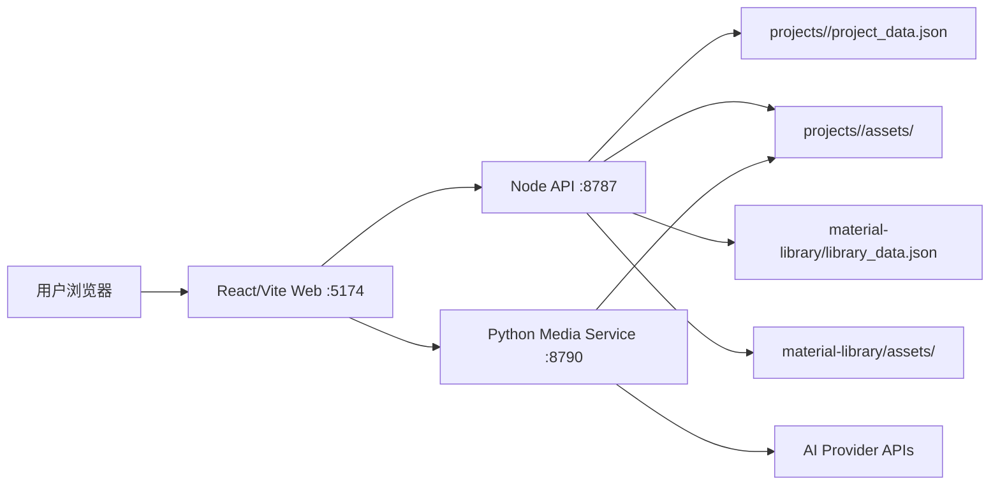

# AGENT.md

本文是 AI agent、开发者和后续协作者进入本项目时必须先读的工程地图。只要功能、需求、架构、配置、数据模型、AI provider 或开发流程发生变化，就必须同步更新本文，保持它始终反映当前真实项目。

## Project Intent

`my-canvas-next` 是旧版 `my-canvas` 的工程化重建版 AI 画布工具。目标不是继续堆旧代码，而是在清晰架构下提供更好用、更易用、更稳定的创作体验。

当前阶段是产品打磨期，不是正式部署期。优先级是用户体验、核心创作闭环、数据可靠性、可维护性和团队理解成本。Docker、Nginx、一键部署可以后置，但架构设计中需要预留。

## Non-negotiable Rules

- 旧项目 `../my-canvas` 只读参考，不直接改动。
- 新功能只在 `my-canvas-next` 中实现。
- API key 不提交到 Git，真实 key 放 `.env.local`。
- 不能把运行数据、用户工程、生成素材、日志、测试结果提交进仓库。
- 前端组件不能散落原始 `fetch`，统一走 feature API 或 shared API client。
- 不能使用浏览器原生 `prompt`、`confirm`、`alert`；必须使用应用内弹窗、表单或 Notice。
- 保存到 `project_data.json` 的只能是领域数据，不能保存 hover、focus、menu、selection 等临时 UI 状态。
- 功能或需求有变动时，必须同步更新 `AGENT.md`、README 或相关 docs。
- commit 信息使用中文。

## Technology Stack

前端：React 19、Vite 8、React Flow、lucide-react、原生 CSS、Playwright。

Node 后端：Node.js ESM、原生 `node:http`、文件系统存储、工程/素材/媒体 API、Node 内置 `node:test`。

Python 媒体服务：Python 3.10+、原生 HTTP 服务、provider adapter 模式、mock/OpenAI/VectorEngine/Ark/DashScope/Xunke adapters。

当前没有使用 PostgreSQL、Redis、登录系统、云存储、队列服务或 ORM。当前数据全部维护在本地文件系统中。后续如接 PostgreSQL/Redis，必须先补数据迁移设计和架构文档。

## Runtime Topology



## Most Important Flows

工程保存：前端编辑 React Flow state -> API client 调 Node API -> schema 校验 -> 写 backup -> 写 `project_data.json` -> 前端更新保存状态。

图片生成：图片节点收集 prompt/参数/上游引用 -> Python media service 选择 image provider -> 保存结果到当前工程 assets -> 前端回写图片节点 -> 保存工程。

视频生成：视频节点收集 prompt/参数/首尾帧 -> Python media service 提交任务 -> 前端轮询任务 -> 成功后下载到当前工程 assets -> 前端回写视频节点 -> 保存工程。

## Data Ownership

前端维护当前打开工程、React Flow nodes/edges/viewport、选择态、弹窗、上传进度、保存状态和生成表单状态。长期数据必须通过 API 保存。

Node API 维护工程数据、工程 assets、素材库数据、素材库 assets、视频剪辑输出和文本分析服务边界。

Python media service 维护图片生成、视频任务、provider 错误规范化和生成结果落盘。

## File Map

```text
src/app/App.jsx                         应用主编排、画布页面、核心交互连接
src/app/styles.css                      全局样式
src/main.jsx                            React 入口
src/features/canvas/model.js            节点创建、持久化字段清理、画布领域模型
src/features/canvas/imageEditing.js     图片裁剪、标注等浏览器端处理
src/features/canvas/nodes/*.jsx         图片、视频、文本节点
src/features/canvas/components/*.jsx    节点共享 UI 组件
src/features/projects/projectApi.js     工程 API client
src/features/projects/ProjectSidebar.jsx 工程列表侧栏
src/features/materials/*.jsx            素材库 UI 和保存弹窗
src/features/materials/materialApi.js   素材库 API client
src/features/generation/generationApi.js 图片/视频生成 API client
src/features/text/textApi.js            文本分析 API client
src/shared/api/client.js                统一请求、错误和超时处理
src/shared/config/featureFlags.js       前端高级能力开关
src/shared/ui/*.jsx                     通用 UI
server/node-api/index.js                Node API 入口
server/node-api/routes/projects.js      工程、assets、视频剪辑接口
server/node-api/routes/materials.js     素材库和素材审核接口
server/node-api/routes/text.js          文本分析接口
server/node-api/services/storage.js     文件存储、路径安全、封面推导
server/node-api/services/schema.js      ProjectData 校验
server/node-api/services/env.js         Node 侧 .env/.env.local 加载
server/media-service/app.py             Python media service 入口
server/media-service/env_loader.py      Python 侧 .env/.env.local 加载
server/media-service/providers/*.py     AI provider adapters
scripts/check-env.mjs                   环境变量完整性检查
scripts/smoke-api.mjs                   Node API smoke test
scripts/legacy-import.mjs               旧工程迁移 preview/write
scripts/legacy-material-import.mjs      旧素材库迁移 preview/write/replace
test/*.test.mjs                         JS 单元和契约测试
test/test_mock_provider.py              Python provider 测试
test/e2e/canvas-smoke.spec.js           Playwright 浏览器冒烟测试
docs/                                  产品、架构、API、数据、路线图和图
```

## AI Provider Matrix

| Provider | Capability | Required key |
| --- | --- | --- |
| `mock` | 图片 + 视频 mock | 无 |
| `openai_image` | 图片生成 | `OPENAI_IMAGE_API_KEY` |
| `vectorengine_image` | Gemini/VectorEngine 图片 relay | `VECTORENGINE_API_KEY` |
| `ark_video` | Ark/Seedance 视频任务 | `ARK_API_KEY` |
| `dashscope_video` | DashScope 视频任务 | `DASHSCOPE_API_KEY` |
| `xunke_video` | Xunke/KKAI Seedance 视频任务 | `XUNKE_API_KEY` |

真实 key 是否可用不能靠仓库保证，只能靠 `.env.local` 和 provider smoke 验收保证。仓库必须保证：缺 key 时错误清晰，有 key 时走统一 adapter，生成结果写入工程 assets。

## Environment Policy

`.env.example` 是模板，`.env.local` 是本地真实配置。`.env.local` 不提交。

本地开发默认 `MEDIA_PROVIDER=mock`。真实 provider 必须配置对应 key，并执行：

```bash
npm run env:check
```

## Local Development

```bash
npm install
Copy-Item .env.example .env.local
npm run env:check
npm run dev
```

访问：

- Web: `http://127.0.0.1:5174`
- Node health: `http://127.0.0.1:8787/api/health`
- Media health: `http://127.0.0.1:8790/api/media-health`

## Verification

```bash
npm run verify
npm run verify:e2e
```

## Product Polish Backlog

当前未进入正式部署期。后续产品打磨优先方向：

1. 更完整的 Playwright 产品路径：上传图片、素材拖入、图片生成、视频轮询。
2. 更清晰的任务队列和生成状态。
3. 更好的节点布局、选中态、多选和快捷操作。
4. 素材库批量管理、搜索体验和错误恢复。
5. 真实 provider smoke 脚本和验收报告。
6. Docker/Nginx/一键部署脚本放到部署阶段实现。

## Documentation Update Rule

每次需求变化都要判断是否需要同步：

- `AGENT.md`：项目事实、架构、数据、流程、AI provider、约束变化。
- `README.md`：启动、验证、使用入口变化。
- `docs/11-user-guide.md`：面向小白用户的使用流程、功能解释和操作步骤变化。
- `docs/07-refactor-roadmap.md`：任务状态变化。
- `docs/04-api-contract.md`：接口变化。
- `docs/05-data-model.md`：数据结构变化。
- `docs/09-media-providers.md`：AI provider 或 key 变化。
