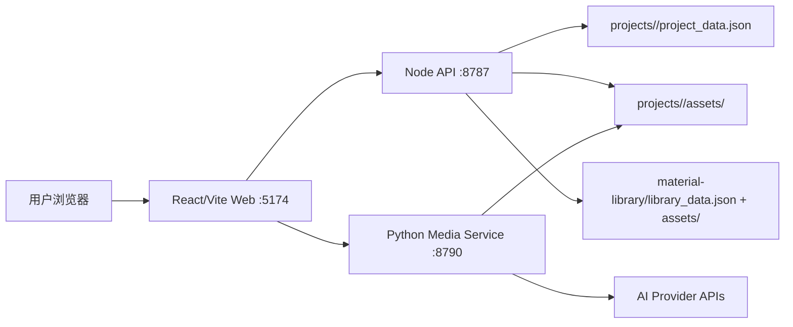

# AI Canvas Studio

工程化重建版 AI 画布。旧项目 `../my-canvas` 仅作为 Legacy Reference，新项目从清晰的目录边界、API 契约和数据模型开始。

## What It Is

这是一个本地优先的 AI 画布创作工具。用户可以创建工程，在 React Flow 画布上组织图片、视频、文本节点，上传素材，调用图片/视频生成 provider，把生成结果保存回当前工程 assets，并逐步从旧项目迁移业务能力。

当前阶段是产品打磨期，不是正式部署期。当前优先级是更好用、更易用、更稳定、更容易被团队理解和继续迭代。Docker、Nginx、一键部署会放在后续部署阶段实现。

## Default Development Entry

所有后续开发、迁移和修复都以本目录为默认入口。旧项目 `../my-canvas` 只用于只读参考，不再直接改动。

## Tech Stack

前端：

- React 19
- Vite 8
- React Flow `@xyflow/react`
- lucide-react
- 原生 CSS
- Playwright

Node 后端：

- Node.js ESM
- 原生 `node:http`
- 本地文件系统存储
- 工程、素材库、媒体文件、视频剪辑、文本分析 API

Python 媒体服务：

- Python 3.10+
- 原生 HTTP 服务
- provider adapter 模式
- mock、OpenAI-compatible image、VectorEngine/Gemini image relay、Ark video、DashScope video、Xunke/KKAI video

当前没有使用：

- PostgreSQL
- Redis
- 登录系统
- 云存储
- 队列服务
- ORM

当前数据全部维护在本地文件系统。后续如果接 PostgreSQL、Redis 或对象存储，必须先补数据迁移设计、架构文档和回滚方案。

## Local Start

第一步，安装依赖：

```bash
npm install
```

第二步，创建本地环境变量文件：

```bash
Copy-Item .env.example .env.local
```

第三步，检查环境变量。默认 `MEDIA_PROVIDER=mock` 时不需要真实 API key：

```bash
npm run env:check
```

第四步，启动全部服务：

```bash
npm run dev
```

服务地址：

- Web: http://127.0.0.1:5174
- Node API: http://127.0.0.1:8787/api/health
- Media service: http://127.0.0.1:8790/api/media-health

也可以分开启动：

```bash
npm run dev:api
npm run dev:media
npm run dev:web
```

分开启动时推荐顺序：

1. `npm run dev:api`
2. `npm run dev:media`
3. `npm run dev:web`

直接执行 `npm run dev` 会自动同时启动三者。

## Environment And API Keys

`.env.example` 是模板，`.env.local` 是真实本地配置。`.env.local` 不能提交到 Git。

本地开发默认：

```env
MEDIA_PROVIDER=mock
```

如果 `MEDIA_PROVIDER` 配了真实 provider 但 key 为空，`npm run env:check` 会失败，避免运行到一半才发现功能不可用。真实 key 不会也不应该写进仓库。

## AI Model And Provider Matrix

| Provider | Model / service | Core responsibility in this project | Env vars | Where to get key |
| --- | --- | --- | --- | --- |
| `mock` | Local mock provider | 本地开发、无 key 验证、基础图片/视频闭环 | none | 不需要 key |
| `openai_image` | OpenAI Images API or OpenAI-compatible image endpoint | 图片节点生成图片，生成后写入当前工程 `assets` | `OPENAI_IMAGE_API_KEY`, `OPENAI_IMAGE_BASE_URL`, `OPENAI_IMAGE_MODEL` | [OpenAI API keys](https://platform.openai.com/api-keys), [OpenAI help](https://help.openai.com/en/articles/4936850-where-do-i-find-my-openai-api-key) |
| `vectorengine_image` | VectorEngine / Gemini-compatible image relay | 图片节点生成图片，可作为 Gemini 图像能力的 OpenAI-compatible relay | `VECTORENGINE_API_KEY`, `VECTORENGINE_BASE_URL`, `VECTORENGINE_IMAGE_MODEL` | VectorEngine 控制台，当前 base URL 为 `https://api.vectorengine.ai/v1` |
| `ark_video` | Volcengine Ark / Seedance video task | 视频节点提交视频生成任务、轮询任务、下载结果到工程 `assets` | `ARK_API_KEY`, `ARK_BASE_URL`, `ARK_VIDEO_MODEL` | [Volcengine Ark console](https://console.volcengine.com/ark/region:ark+cn-beijing/apiKey), [Volcengine docs](https://www.volcengine.com/docs/82379/1803071) |
| `dashscope_video` | Alibaba Cloud DashScope / Wan image-to-video | 视频节点图片转视频任务，要求输入图片 | `DASHSCOPE_API_KEY`, `DASHSCOPE_VIDEO_MODEL` | [Alibaba Cloud Model Studio docs](https://www.alibabacloud.com/help/doc-detail/2846132.html), DashScope console |
| `xunke_video` | Xunke/KKAI Seedance-compatible video API | 视频节点 Seedance-compatible 生成任务 | `XUNKE_API_KEY`, `XUNKE_BASE_URL`, `XUNKE_VIDEO_MODEL_SEEDANCE_2_0`, `XUNKE_VIDEO_MODEL_SEEDANCE_2_0_720P` | Xunke/KKAI 服务商控制台，按供应商账号获取 |

注意：

- OpenAI key 创建后通常只完整展示一次，必须保存到本地安全位置。
- DashScope 官方 SDK 支持通过 `DASHSCOPE_API_KEY` 环境变量认证。
- Seedance 的官方/渠道形态会随供应商变化，本项目当前以 Ark 和 Xunke/KKAI adapter 接入，不把 key 写入前端。
- 所有真实 provider 调用都必须经过 Python media service，不能在浏览器端暴露 key。

## Architecture At A Glance



开发期由 Vite proxy 分流：

- `/api/generate-image` -> Python media service
- `/api/generate-video` -> Python media service
- `/api/video-task/*` -> Python media service
- `/api/media-health` -> Python media service
- 其他 `/api/*` -> Node API

更多蓝图、时序图和文件职责见 `AGENT.md` 与 `docs/diagrams/`。

## Core Flows

工程保存：

1. 用户编辑节点、连线或工程信息。
2. 前端维护 React state，并触发自动保存或手动保存。
3. `src/features/projects/projectApi.js` 调用 Node API。
4. Node API 校验 `ProjectData` schema。
5. 保存前写入 `project_data.backup.json`。
6. 写入 `projects/<slug>/project_data.json`。
7. 前端更新保存状态。

图片生成：

1. 图片节点收集 prompt、参数、上游引用。
2. 前端调用 `src/features/generation/generationApi.js`。
3. Python media service 选择 image provider。
4. provider 返回图片数据或图片 URL。
5. media service 保存结果到 `projects/<slug>/assets/`。
6. 前端把 asset 回写到图片节点并保存工程。

视频生成：

1. 视频节点收集 prompt、参数、首帧/尾帧引用。
2. 前端提交视频任务。
3. Python media service 选择 video provider。
4. 前端轮询 `/api/video-task/:taskId`。
5. 成功后 media service 下载结果到工程 assets。
6. 前端把视频 asset 回写到视频节点并保存工程。

## Data

前端维护：

- 当前打开工程
- React Flow nodes/edges/viewport
- 当前选择、弹窗、上传进度、保存状态
- 生成表单状态

前端不直接维护长期数据。长期数据必须通过 API 保存。

Node API 维护：

- `projects/<slug>/project_data.json`
- `projects/<slug>/assets/`
- `material-library/library_data.json`
- `material-library/assets/`

Python media service 维护：

- 图片生成
- 视频任务提交和查询
- provider 错误规范化
- 生成结果保存到工程 assets

## Runtime Data And Future Volumes

以下目录是运行数据，不提交 Git：

- `projects/`
- `material-library/assets/`
- `material-library/library_data.json`
- `logs/`
- `dist/`
- `test-results/`
- `playwright-report/`

未来 Docker 部署时，这些目录会设计为数据卷：

- `projects:/app/projects`
- `material-library:/app/material-library`
- `logs:/app/logs`

## Verification

```bash
npm run env:check
npm run verify
npm run verify:e2e
```

## Docs

- `AGENT.md`：给 AI agent 和开发者的一眼看懂工程地图。
- `MIGRATION.md`：旧项目数据迁移步骤、备份和失败恢复。
- `OPERATIONS.md`：环境变量、端口、启动、日志和常见错误。
- `CONTRIBUTING.md`：目录规范、提交规范、评审和验证要求。
- `docs/07-refactor-roadmap.md`：完整阶段任务清单。
- `docs/09-media-providers.md`：AI provider 说明。
- `docs/10-legacy-feature-matrix.md`：旧功能迁移、替代和废弃对照。

## Current Capability

- 工程列表、创建、打开、保存、重命名、删除
- React Flow 图片/视频/文本节点
- 本地素材上传到工程 assets
- Mock 和真实 provider 图片/视频生成链路
- 基础素材库、高级素材筛选和旧素材库迁移
- 图片裁剪、标注、视频首尾帧引用、基础剪辑、生成历史、工程缩略图

## Deployment Direction

正式部署放到后续阶段。预期方案：

- Nginx 容器托管前端静态资源
- Nginx 反向代理 Node API 和 Python media service
- Node API 独立容器
- Python media service 独立容器，内置 ffmpeg
- Docker Compose 编排全部服务
- 首次部署脚本一键启动
- 后续更新脚本一键拉取、构建、重启

当前阶段不优先做部署，优先继续产品体验打磨。
