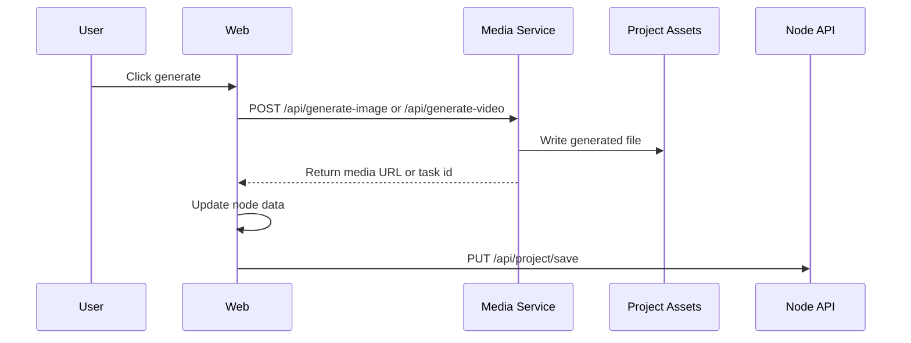

# Generation Sequence

```mermaid
sequenceDiagram
  participant U as User
  participant W as Web
  participant M as Media Service
  participant FS as Project Assets
  U->>W: Click generate
  W->>M: POST /api/generate-image or /api/generate-video
  M->>FS: Write generated file
  M-->>W: Return media URL or task id
  W->>W: Update node data
  W->>Node API: PUT /api/project/save
```
