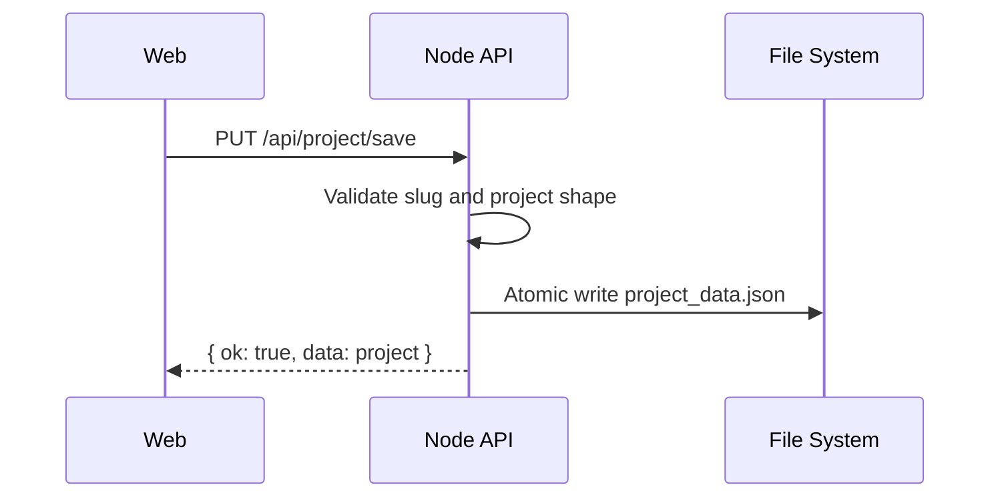

# Project Save Sequence

```mermaid
sequenceDiagram
  participant W as Web
  participant A as Node API
  participant F as File System
  W->>A: PUT /api/project/save
  A->>A: Validate slug and project shape
  A->>F: Atomic write project_data.json
  A-->>W: { ok: true, data: project }
```
