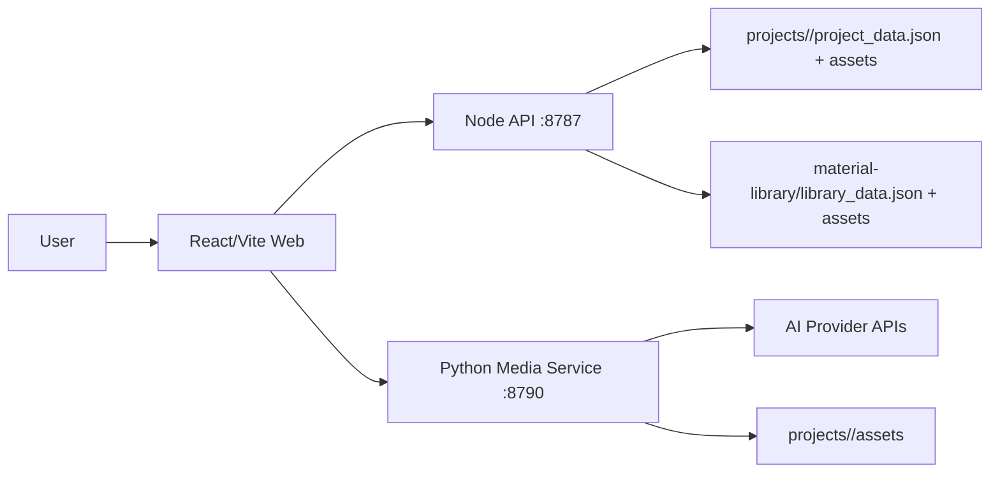
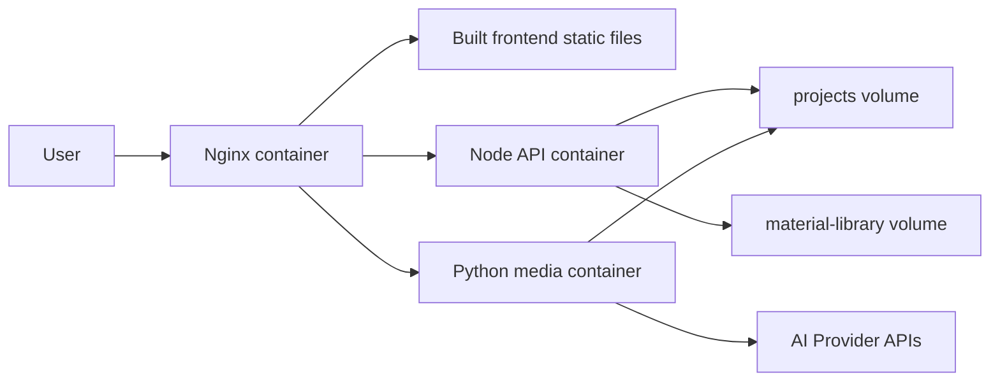

# System Architecture

```mermaid
flowchart LR
  User["User"] --> Web["React/Vite Web"]
  Web --> NodeApi["Node API :8787"]
  Web --> Media["Python Media Service :8790"]
  NodeApi --> Projects["projects/<slug>/project_data.json + assets"]
  NodeApi --> Library["material-library/library_data.json + assets"]
  Media --> Providers["AI Provider APIs"]
  Media --> ProjectAssets["projects/<slug>/assets"]
```

## Future Docker/Nginx Topology

```mermaid
flowchart LR
  User["User"] --> Nginx["Nginx container"]
  Nginx --> WebStatic["Built frontend static files"]
  Nginx --> NodeApi["Node API container"]
  Nginx --> Media["Python media container"]
  NodeApi --> VolumeProjects["projects volume"]
  NodeApi --> VolumeLibrary["material-library volume"]
  Media --> VolumeProjects
  Media --> Providers["AI Provider APIs"]
```
